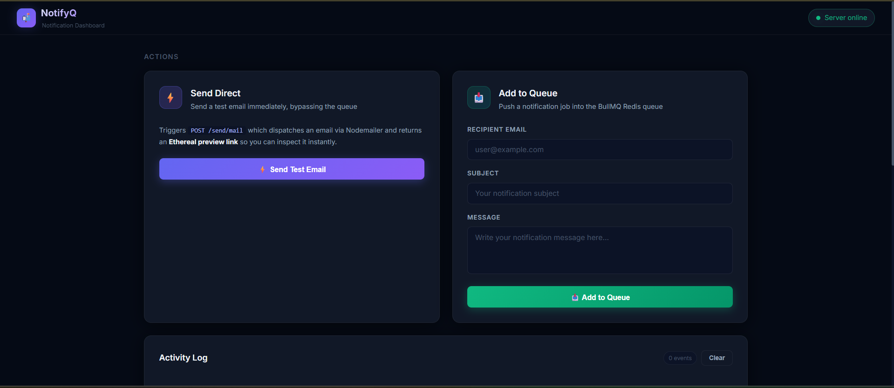
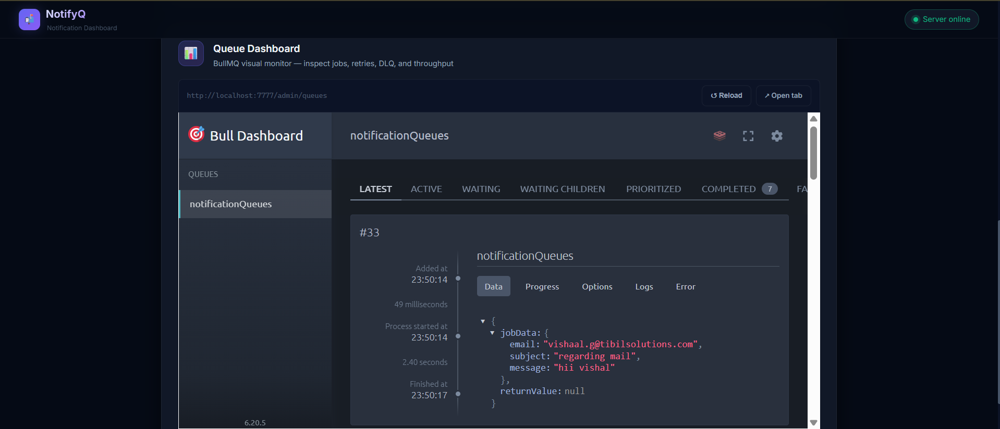

- Install Dependencies 
```
    npm i express dotenv nodemailer
    npm install bullmq ioredis
    npm install @bull-board/api @bull-board/expressnpm install @bull-board/api @bull-board/express
```

- Run redis image / download it from off website
```
    docker run -d -p 6379:6379 redis

```

basically we have to expose a set of apis where , one api is used for adding the nofication req in a queue
and worker pull a msg one by one from the queue and processed it and send a res , and if failed the retry mechanism should be happend and if it exhaust max retries then put into the dlq so that we can maNullay trigger either human interation or using cronjob;
but to make sure whether it is successed or not we need to look in db (you can also use outbox patter for surity)


```
User Action
 │
 ▼
Notification API
 │
 ▼
Redis Queue   
 │
 ▼
Email Workers
 │
 ▼
Rate Limiter
 │
 ▼
SMTP Provider
```

- If you want to see dashboard of bullMq : ` http://localhost:7777/admin/queues `

- Currently we have two endpoints one is for adding msg in msg queues `http://localhost:7777/add/notification` and another one is for manully triggers the mail notification `http://localhost:7777/send/mail`




